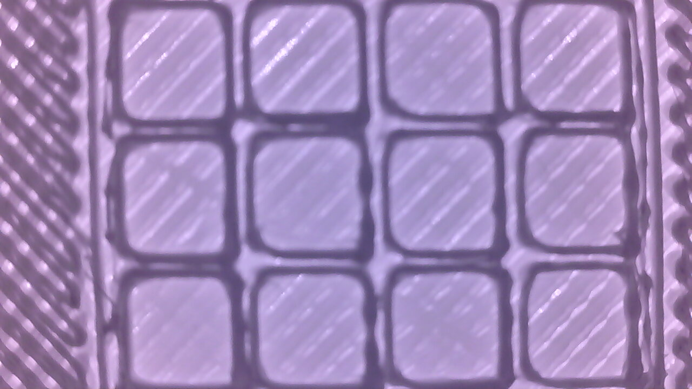

# Drosophila embryo monitoring system

This is a small video system to monitor the development of Drosophila embryos.

--- 

## Hardware:

|Qty|item|obs|link|
|--|--|--|--|
|1|200mm makerbeam XL aluminium profiles|pieces to hold the grid that will contain the embryos aluminium profiles||
|2|100mm makerbeam XL aluminium profiles|camera mounting frame||
|2|150mm makerbeam XL aluminium profiles|camera mounting frame||
|4|"L" bracket makerbeam XL|holds the aluminium profiles together||
|1|3D printed embryo grid|initially printed in black PLA||
|18|M3 5mm screws| holds maker beams and other bits together||
|14|M3 nuts|used together with screws||

---

## Software:
  
  - For this system we used Bonsai-RX to control the camera, as it allows for flexibility in determining time lapse rates and movement tracking of the embryos. 

  
--- 

## Setup images:

|||
|--|--|
|||

---

## Some initial taken with the setup images:

- note: the printer used to make the grid in the images below was poorly calibrated, the final grid looks much better.

||empty|water|
|--|--|--|
|Visible light|||
|Infra red light|||

## TODO:

### Software analysis:
- Create a jupyter notebook to process the data
 - Subtract running average from brightness average.
 - square square root (so that all values are positive)
 - find hatching point of the embryos (they poke out their heads at the top of the egg shell). This leads normally to a peak on the values of the traces. (maybe shape of the egg.)

  - parameters that are calculated from traces:
   - total movement (sum all of the values above a threshold)
   - percentage time moving (number of frames where movement is above the threshold)
   - average movement amplitude (average of movement above a certain threshold)
   - time between first movement and hatching
   - phases movement 
     - high frequency (slow increase and slow decrease)
     - bursts of movement
   - fft analysis
    - bin traces into 30min periods and show how frequency content changes in each bin 

### Hardware:

- test different cameras and lighting conditions

- Optogenetics led:
- LED ring turning on the red channel for 500 ms every 30 seconds. 